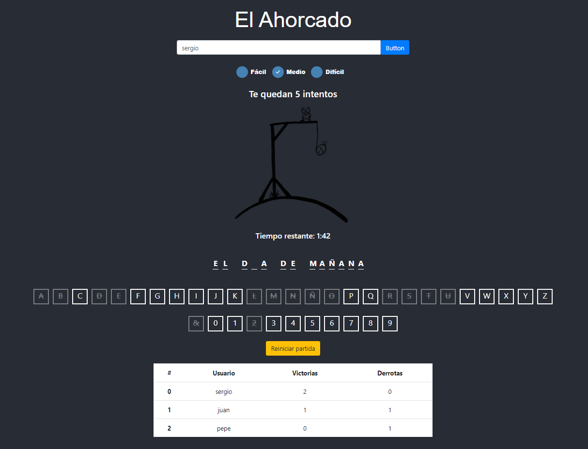

# -MIMO-HTML5-Ahorcado-React

HANGMAN game created with React

- There are 3 game difficulties, according to the number of times you can fail and the time you have to solve it:
	1. Easy.
        * Attemtps: 1,5 times the number of letters.
        * Time to solve: no limit.
	2. Medium.
        * Attemtps: as many as letters.
        * Time to solve: 2 minutes.
	3. Difficult.
        * Attemtps: 0,8 times the number of letters.
        * Time to solve: 1 minute.

- The player will introduce a letter for each attempt:
    * Every hidden letter which match with the letter introduced will be revealed.
    * If any of the hidden letter matches with the letter introduced, an attempt will be subtracted.

- The player wins the game when achieves to guess every letter without using up all the attempts.

- Every game will be save associated to the player's name. A ranking with all the players will be visualized, ordered descending by won games.

